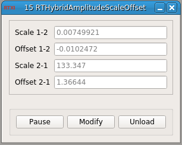

### RTHybrid Amplitude scale and offset calculator module for RTXI

**Requirements:** None  
**Limitations:** None  

<!--start-->

<b>RTHybrid Amplitude Scale Offset:</b> Given two neurons membrane potential minimum and maximum values, this module calculates the amplitude scale factor and offset between them, in both directions. i.e. if Neuron 1 membrane potential is multiplied by Scale 1-2 and added Offset 1-2, the result will be in the same amplitude range than Neuron 2 membrane potential, and viceversa.

<!--end-->

#### Input
1. input(0) - Min 1 (V) : Neuron 1 minimum membrane potential (in V)
2. input(1) - Max 1 (V) : Neuron 1 maximum membrane potential (in V)
3. input(2) - Min 2 (V) : Neuron 2 minimum membrane potential (in V)
4. input(3) - Max 2 (V) : Neuron 2 maximum membrane potential (in V)

#### Output
1. output(0) - Scale 1-2 : Scale from neuron 1 to neuron 2
2. output(1) - Offset 1-2 : Offset from neuron 1 to neuron 2
3. output(2) - Scale 2-1 : Scale from neuron 2 to neuron 1
4. output(3) - Offset 2-1 : Offset from neuron 2 to neuron 1

#### Parameters

#### States
1. Scale 1-2 - Scale from neuron 1 to neuron 2
2. Offset 1-2 - Offset from neuron 1 to neuron 2
3. Scale 2-1 - Scale from neuron 2 to neuron 1
4. Offset 2-1 - Offset from neuron 2 to neuron 1
