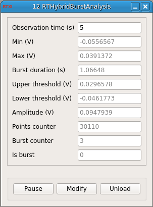

### RTHybrid Burst Analysis module for RTXI

**Requirements:** None  
**Limitations:** None  

<!--start-->

<b>RTHybridBurstAnalysis:</b> RTHybrid module for RTXI to get the minimum and maximum membrane potential values of a neuron and its bursts duration.

<!--end-->

#### Input
1. input(0) - Vm (V) : Membrane potential (in V)

#### Output
1. output(0) - Min (V) : Minimum membrane potential (in V)
2. output(1) - Max (V) : Maximum membrane potential (in V)
3. output(2) - Burst duration (s) : Average burst duration (in s)

#### Parameters
1. Observation time (s) - Duration of the interval where the minimum and maximum membrane potential and the burst duration will be detected (in s)

#### States
1. Min (V) - Minimum membrane potential (in V)
2. Max (V) - Maximum membrane potential (in V)
3. Burst duration (s) - Average burst duration (in s)
4. Upper threshold (V) - Upper threshold for burst detection (in V)
5. Lower threshold (V) - Lower threshold for burst detection (in V)
6. Amplitude (V) - Membrane potential amplitude (in V)
7. Points counter - Number of points so far in the current interval
8. Burst counter - Number of bursts so far in the current interval
9. Is burst - 1 if it is currently a burst or 0 if not
