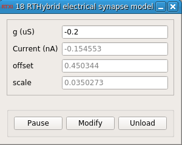

### RTHybrid electrical synapse model

**Requirements:** None  
**Limitations:** None  

<!--start-->

<b>RTHybrid electrical synapse model</b><

<!--end-->

#### Input
1. input(0) - Post-synaptic Voltage (V) : 
2. input(1) - Pre-synaptic Voltage (V) : 
3. input(2) - Scale (Pre to Post) : 
4. input(3) - Offset (Pre to Post) : 

#### Output
1. output(0) - Current (nA) : Synaptic current (in nA)

#### Parameters
1. g (uS) - Conductance (uS)

#### States
1. Current (nA) - 
2. offset - 
3. scale - 
