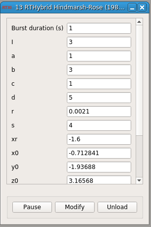

### RTHybrid Hindmarsh-Rose (1986) neuron model

**Requirements:** None  
**Limitations:** None  

<!--start-->

<b>RTHybrid Hindmarsh-Rose (1986) neuron model</b>

<!--end-->

#### Input
1. input(0) - Isyn (nA) : Synaptic input current (in nA)
2. input(1) - Burst duration (s) : 

#### Output
1. output(0) - Vm (v) : Membrane potential (in V)
2. output(1) - Vm (mV) : Membrane potential (in mV)

#### Parameters
1. Burst duration (s) - 
2. I - 
3. a - 
4. b - 
5. c - 
6. d - 
7. r - 
8. s - 
9. xr - 
10. x0 - 
11. y0 - 
12. z0 - 

#### States
1. v - 
2. s_points - 
3. dt - 
4. syn - 
