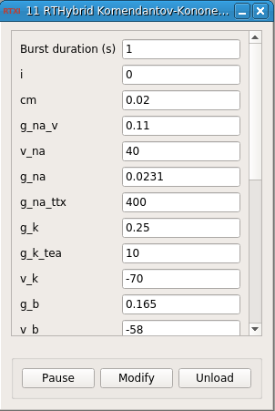

### RTHybrid Komendantov-Kononenko (1996) neuron model

**Requirements:** None  
**Limitations:** None  

<!--start-->

<b>RTHybrid Komendantov-Kononenko (1996) neuron model</b>

<!--end-->

#### Input
1. input(0) - Isyn (nA) : Synaptic input current (in nA)
2. input(1) - Burst duration (s) : 

#### Output
1. output(0) - Vm (v) : Membrane potential (in V)
2. output(1) - Vm (mV) : Membrane potential (in mV)

#### Parameters
1. Burst duration (s) - 
2. i - 
3. cm - 
4. g_na_v - 
5. v_na - 
6. g_na - 
7. g_na_ttx - 
8. g_k - 
9. g_k_tea - 
10. v_k - 
11. g_b - 
12. v_b - 
13. g_ca - 
14. v_ca - 
15. g_ca_ca - 
16. k_beta - 
17. beta - 
18. rho - 
19. k_s - 
20. v0 (mV) - 

#### States
1. v - 
2. s_points - 
3. dt - 
4. syn - 
